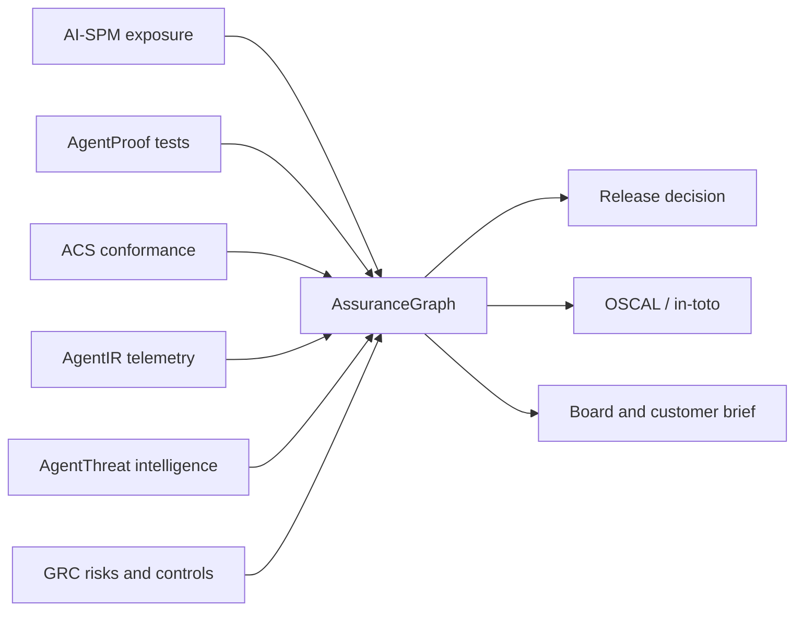

# AI Governance Evidence Graph

[](https://github.com/AAH20/ai-governance-evidence-graph/actions/workflows/ci.yml)
[](LICENSE)
[](#)

**Continuous AI assurance cases, EU AI Act evidence support, ISO 42001 and NIST AI RMF traceability, AI audit automation, OSCAL-shaped assessment results, in-toto attestations and cyber-risk economics.**

AssuranceGraph compiles technical and governance evidence into a bounded, reviewable deployment decision:

```text
Claim → Argument → Evidence
  │          │         ├─ provenance and integrity
  │          │         ├─ freshness and reproducibility
  │          │         └─ environment/version equivalence
  │          ├─ assumptions
  │          └─ counterevidence
  └─ context, owner, expiry and reassessment triggers
                              ↓
        APPROVE / APPROVE_WITH_RESTRICTIONS / REJECT
```

> **Boundary:** this project provides decision support. It does not determine legal applicability, certify compliance, provide legal advice or authorize production by itself. Regulatory mappings require qualified legal and compliance review.

## Why assurance cases

Control checklists answer whether evidence was uploaded. Assurance cases answer whether the evidence actually supports a specific claim for a specific system version, environment and operating context.

AssuranceGraph detects problems that static compliance matrices usually miss:

- A production claim supported only by a staging test
- A claim for version 2.4 supported by version 2.3 evidence
- Expired or tampered evidence
- An unresolved incident contradicting a passing test
- An assumption invalidated by an architectural change
- A top-level claim whose dependency no longer holds
- A risk acceptance without an accountable owner

## Quick start

```bash
python -m assurancegraph.cli validate fixtures/refund-agent/case.json

python -m assurancegraph.cli compile fixtures/refund-agent/case.json \
  --as-of 2026-09-06 --output assessment.json

python -m assurancegraph.cli change-impact fixtures/refund-agent/case.json \
  fixtures/refund-agent/change.json --output impact.json

python -m assurancegraph.cli export fixtures/refund-agent/case.json \
  --as-of 2026-09-06 --format markdown --output board-brief.md

python -m assurancegraph.cli economics fixtures/economics.json \
  --output economics.json
```

## Executable refund-agent case

The included case makes four linked claims:

1. Refund actions use an audience-bound workload identity.
2. Actions can be reconstructed through the payment outcome.
3. Material refunds require scoped human approval.
4. The agent is acceptably controlled for its declared context.

Four evidence artifacts have real SHA-256 digests. The baseline compiles to `APPROVE`.

A simulated change adds a second payment path outside the evaluated gateway. It invalidates the critical payment claim and top-level assurance claim, blocks release and returns `REASSESS`.

## Evidence-quality scoring

Each artifact is evaluated for:

| Dimension | Weight |
|---|---:|
| Provenance | 15 |
| SHA-256 integrity | 15 |
| Freshness | 15 |
| Environment equivalence | 15 |
| System-version equivalence | 15 |
| Reproducibility | 15 |
| Independent review | 10 |

The default acceptance threshold is 70. Scores do not override negative evidence or invalid assumptions: a high-quality failing test remains counterevidence.

## Change-aware invalidation

Claims declare reassessment triggers such as:

- Model, prompt or agent-framework change
- Tool or MCP capability change
- Identity or credential-policy change
- New payment execution path
- Telemetry schema or routing change
- Data classification or jurisdiction change
- Material incident or threat-intelligence update

Specific triggers always apply. The `any-material-change` wildcard activates only when the incoming change is explicitly classified as material.

## Exports

- Native assessment JSON with claim-level reasoning
- OSCAL-shaped Assessment Results
- in-toto Statement v1-compatible envelope
- Executive Markdown brief
- Dependency-free offline HTML
- Canonical assessment SHA-256 digest

The OSCAL output is an implementation profile and must be validated against the selected official NIST schema before exchange. The in-toto statement is unsigned; signing identity and key management remain separate controls.

## Continuous integration

```yaml
- uses: AAH20/ai-governance-evidence-graph@v1
  with:
    case: assurance/refund-agent.json
    fail-on: restricted
```

The action produces assessment, OSCAL, in-toto, Markdown and HTML artifacts. A rejected or restricted decision can fail the release gate.

## Governance and regulatory support

AssuranceGraph is designed to organize evidence relevant to:

- EU AI Act risk management, technical documentation, recordkeeping, transparency, human oversight, robustness, cybersecurity and post-market monitoring
- ISO/IEC 42001 AI management systems
- NIST AI Risk Management Framework
- NIST Cyber AI Profile
- Agent Control Standard
- OWASP Top 10 for Agentic Applications
- Internal audit, customer assurance and model-risk governance

Mappings are implementation aids—not compliance determinations. They must include source, version, applicability date, operator role, jurisdiction, reviewer and review date.

## Integration with the wider portfolio

An optional [typed shadow-decision pilot](docs/TYPED_DECISION_PILOTS.md) now provides a provider-neutral `decision-proposal.v1` contract and six synthetic GRC, IAM, and physical-incident review-routing cases. It runs offline by default; a Jev adapter requires an explicit network flag and a TypeSafe API key. Outputs are hash-bound to the shared assurance-result v1 format and cannot authorize access, certify compliance, or control physical devices.



## KPIs

### Evidence integrity

- Provenance and digest-validation rate
- Evidence freshness
- Environment/version equivalence
- Independent-review coverage
- Reproduction success
- Orphan and duplicate evidence

### Claim quality

- Supported claims
- Unsupported critical claims
- Claims with counterevidence
- Unverified assumptions
- Named ownership and bounded-context coverage
- Expired and invalidated claims
- Defeater-resolution time

### Operational outcomes

- Change-to-invalidation time
- Invalidation precision and recall
- Reassessment lead time
- Releases stopped by stale evidence
- Audit evidence acceptance
- Decision reversal after incidents

See [KPIs and unit economics](docs/KPIS_AND_UNIT_ECONOMICS.md).

## Unit economics

```text
Cost per case             = evidence + validation + review + platform cost / cases
Cost per defensible claim = total assurance cost / claims surviving review
Change-impact savings     = avoided full reassessment hours × loaded hourly cost
Expected loss reduction   = probability × impact × demonstrated effectiveness
Net assurance value       = risk reduction + audit and engineering savings
                             + attributable revenue − total assurance cost
```

Direct revenue, contributory attribution and capacity-enabled pipeline remain separate. Capacity pipeline is not included in net value.

## Public benchmark roadmap

The **AI Assurance Evidence Benchmark** will measure unsupported-claim detection, contradiction detection, stale-evidence detection, change-impact precision and recall, cross-environment evidence misuse, decision reproducibility, review time and cost per defensible claim.

## Roadmap

- **v0.1:** DAG validation, evidence scoring, decisions, change invalidation, exports and economics
- **v0.2:** SARIF, JUnit, OTel, AI-SPM, AgentIR and ACS adapters
- **v0.3:** regulatory mapping packs with provenance and review workflow
- **v0.4:** Sigstore signing, transparency log and policy-as-code release integration
- **v1.0:** versioned assurance patterns and public evidence benchmark

## Development

```bash
python -m unittest discover -s tests -v
python -m compileall -q assurancegraph tests
```

See [CONTRIBUTING.md](CONTRIBUTING.md) before adding regulatory content or public comparison data.

## License and trademarks

Apache-2.0. Standards and product names belong to their respective owners. References do not imply affiliation, certification or endorsement.
