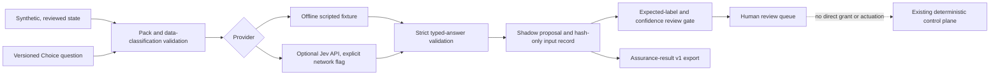

# Typed decision proposals: portfolio shadow pilot

This pilot gives GRC evidence, agent identity, and physical-AI incident workflows one inspectable **review-routing proposal** format. It does not grant authority, control a robot, decide compliance, or identify a person. The implementation is Choice-only in v1; Score and Noul need their own validators, fixtures, and calibration evidence before use.



## Executable pilots

| Case family | Intended consumer | Question | Control boundary |
|---|---|---|---|
| `grc-evidence` | GRC Claw and AssuranceGraph evidence desk | Which queue should review a synthetic evidence item? | A proposal cannot qualify a control or certify compliance. |
| `iam-request` | AgentIAM and Identity Fabric Benchmarks | Which queue should review a synthetic access request? | IAM/PAM grants remain with the authorization engine. |
| `physical-incident` | Robot Black Box and BioPhysical Assurance Commons | Which queue should review a synthetic incident record? | Safety interlocks and recorder verification remain deterministic. |

The six scripted cases include one **high-confidence wrong answer** about an administrator-role request and two correctly labeled cases below their illustrative review thresholds. The report exposes this as a critical misroute and computes coverage and a diagnostic multiclass Brier score. Six scripted cases cannot establish real calibration or Jev accuracy. The thresholds exercise routing behavior only; deployment thresholds require representative, labeled data and risk-specific calibration.

## Run without an API key

```bash
python -m pip install -e .
assurancegraph-decisions fixtures/shadow-decisions/pilots.v1.json \
  --output reports/shadow-decisions.json \
  --assurance-output reports/shadow-assurance.json
python -m unittest discover -s tests -v
```

`decision-proposal.v1` exports the provider and model, input digests, bounded answer, probabilities, confidence, labeled evaluation, disposition, latency and token usage. It omits raw state and credentials. The second file follows BioPhysical Assurance Commons' `assurance-result.v1` contract. Its score remains null and its verification is `none`.

## Optional live Jev experiment

The [TypeSafe API](https://docs.typesafe.ai/introduction/quickstart) accepts state and typed questions at `POST /v1/systemone`. The live adapter uses that documented Choice shape and sends only packs declared `public-synthetic`. It does **not** verify that a declaration is truthful or automatically remove personal data. Review the entire pack before enabling a hosted call.

```bash
export TYPESAFE_API_KEY='your-key-from-TypeSafe'
assurancegraph-decisions fixtures/shadow-decisions/pilots.v1.json \
  --provider jev --allow-network \
  --output reports/jev-shadow.json \
  --assurance-output reports/jev-assurance.json
```

The API key is read from the environment and is never written to an artifact. The adapter uses HTTPS, rejects redirects, disables proxies, and bounds response size and time. Calls may incur provider charges. Do not send customer records, secrets, biometric templates, surveillance footage, unpublished network topology, or classified information through this experimental path. Use a local provider implementing the same contract when data residency or classification prevents a hosted call.

## Evolution gates

1. **Contract:** reject malformed packs, invalid probabilities, missing choices and non-synthetic declarations; errors abstain.
2. **Shadow benchmark:** compare with independent labels; track accuracy, false-negative rate for critical routes, abstention and escalation rates, Brier score or ECE on sufficiently sized labeled sets, latency and token usage. Keep results segmented by domain and data source.
3. **Challenge:** test missing context, contradicting evidence, stale records, adversarial text, class imbalance and version drift. A high confidence wrong answer remains a failure.
4. **Human-assisted routing:** only after thresholds are established on held-out data, allow bounded queue recommendations. The receiving control plane still applies deterministic authorization and safety policy.
5. **Production assessment:** add independent evidence retention, privacy review, access controls, incident response, rollback, and recurring calibration before any broader rollout.

The [TypeSafe confidence guidance](https://docs.typesafe.ai/confidence) recommends thresholds suited to the stakes and validation on the application's own data. This pilot deliberately does not invent production thresholds or claim that the vendor's published benchmark results transfer to these domains.

## Portfolio adoption map

The same proposal contract can be reused after each project supplies a reviewed, minimized state adapter and its own labeled evaluation set. These integrations are **planned**, not claimed live:

| Project family | Candidate judgment | Required independent boundary |
|---|---|---|
| GRC Claw, EvalLake, Evidence Graph | Evidence-review queue and source-change priority | Control and evidence qualification |
| AgentIAM, Identity Fabric Benchmarks, Egypt Digital Trust Map | Access-review queue and benchmark-case triage | IAM/PAM decision and sovereignty policy |
| Robot Black Box, Physical AI Governor, BioPhysical Assurance Commons | Incident-review queue | Physical interlocks, leases, recorder verification |
| SOC and threat-intelligence repositories | Analyst queue or bounded next investigation | Containment approval and customer scope |
| Cloud, GPU, infrastructure and FinOps repositories | Optimization-review priority | Deployment authority, budget and rollback gates |
| RAG and knowledge repositories | Retrieval-workflow classification | Document ACL and citation verification |
| Edge vision, biometrics and BCI repositories | Quality or uncertainty review | Consent, identity thresholds and physical intervention |

No adapter should forward raw biometric data, customer telemetry, private prompts, or identities to the hosted pilot. A domain joins only after its state minimization, test labels, drift monitoring and human-review process are independently checked.
